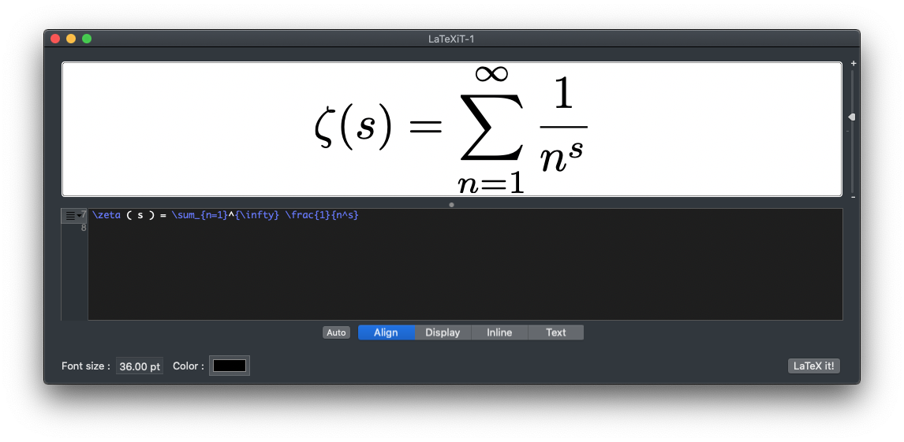
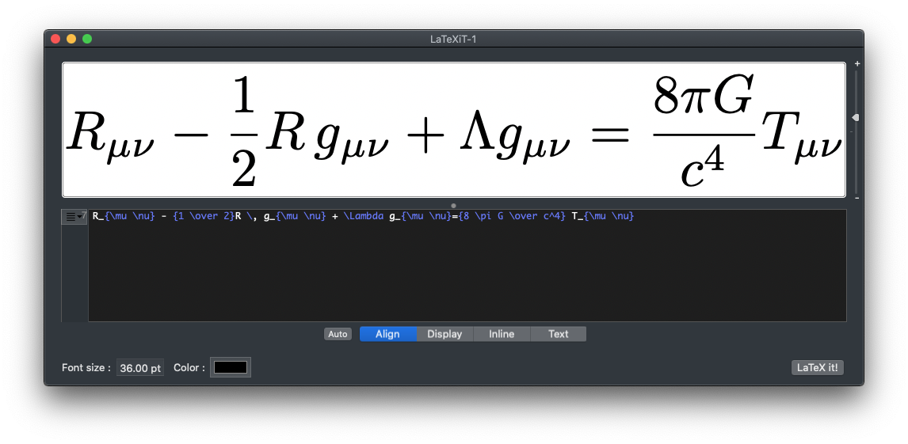
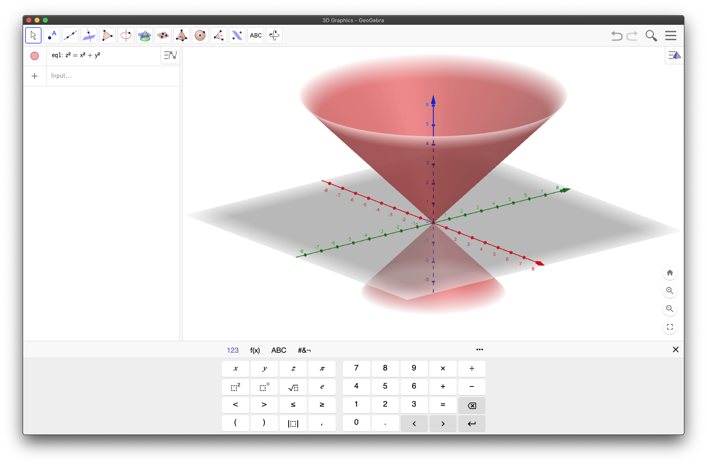
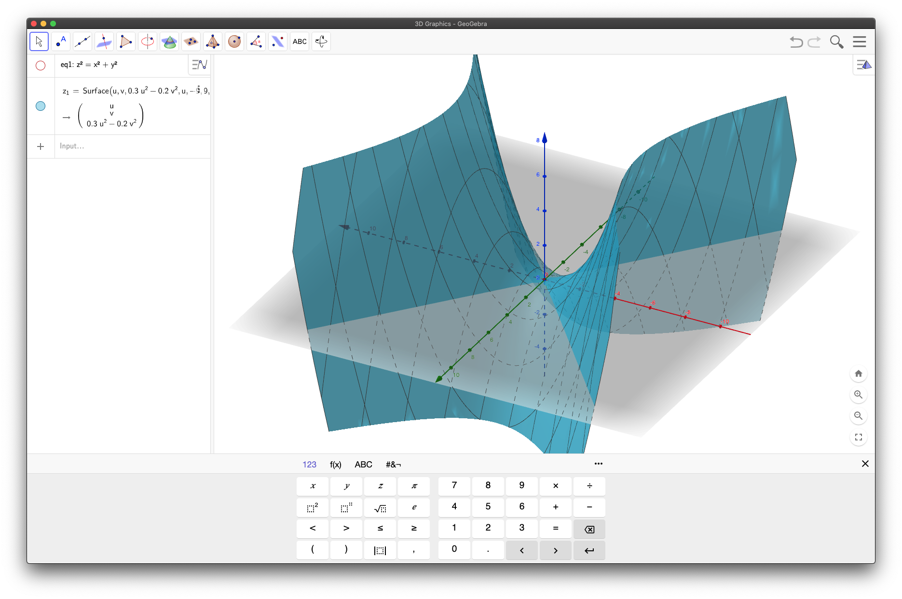
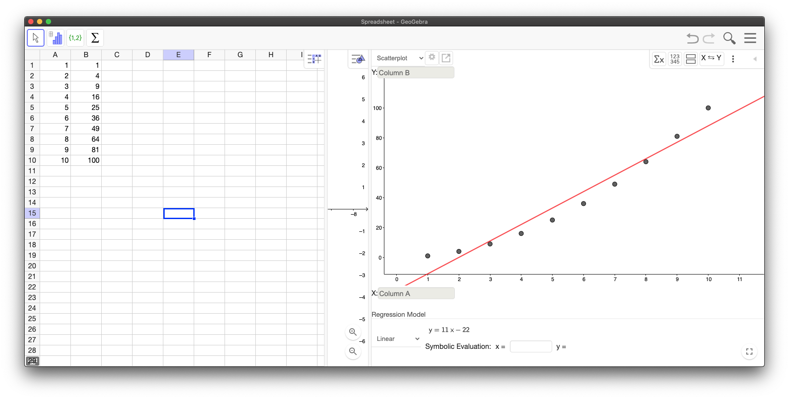
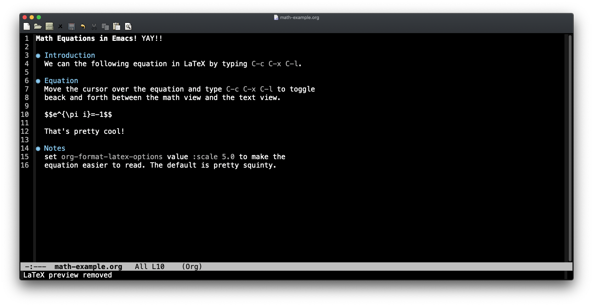
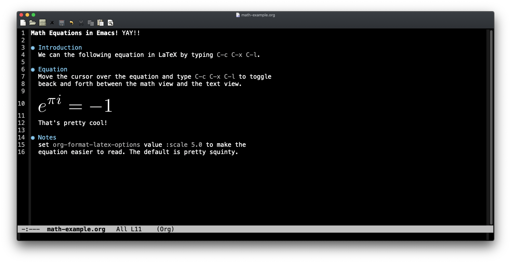

# How i setup my Mac for development

# Table of Contents
<details>
  <summary>Click to expand!</summary>

<!--ts-->
  * [Introduction](#introduction)
  * [Package Manager](#package-manager)
    * [Brew Installation](#brew-installation)
    * [Basic Packages](#basic-packages)
  * [Basic zshrc](#basic-zshrc)
  * [Editors and IDEs](#editors-and-ides)
  * [Languages and Compilers](#languages-and-compilers)
  * [Containers: Docker, Podman, Colima](#containers-docker-podman-colima)
  * [Python](#python)
  * [AWS](#aws)
    * [awscliv1](#awscliv1)
    * [awscliv2](#awscliv2)
  * [Drawing Tool (drawio)](#drawing-tool)
  * [Mathy Stuff](#mathy-stuff)
    * [LaTeXiT](#latexit)
      * [Riemann Zeta Function](#riemann-zeta-function)
      * [EFE](#efe)
      * [A more complex example](#a-more-complex-example)
    * [Geogebra](#geogebra)
      * [Cone](#cone)
      * [Saddle Plot](#saddle-plot)
      * [Linear Regression Plot](#simple-linear-regression-analysis)
    * [GNUplot](#gnuplot)
      * [Linear Regression Plot](#linear-regression-plot)
    * [Grafana](#grafana)
  * [Animated GIFs](#animated-gifs)
  * [Visual Diffs](#visual-diffs)
  * [Appendix A - Removing macports](#appendix-a---removing-macports)
  * [Appendix B - Embed Math Equations in Emacs](#appendix-b---embed-math-equations-in-emacs)
  * [Appendix C - Multiline jq Queries](#appendix-c---multiline-jq-queries)
  * [Appendix D - Search a Huge Number of Files](#appendix-d---search-a-huge-number-of-files)
  * [Appendix E - Spell Check Markdown Files](#appendix-e---spell-check-markdown-files)
  * [Appendix F - Useful CLI tools](#appendix-f---useful-cli-tools)


<!--te-->
</details>

# Introduction
This document describes how i setup my mac for development work. It is
not official in any way and the choice of tools is opinionated. It is very
much a _note to self_. Hopefully it will be of some use to other folks.

The Mac is not my first choice for a development environment mainly
because it runs Mac OSX and my first choice is Linux but i
have both Linux and MacOS laptops and want to be able to use
both effectively.

I put this document together for two reasons.

First, _many_ of the native Mac OSX command line tools are ancient POSIX versions of things
like `bash`, `date`, `find`, `awk` and `xargs`.
In _most_ cases the tools have not been updated in _more_ than a decade when compared to their Linux counterparts
which means that they are often missing important bug fixes, performance enhancements and useful modern options.

Second, there are a number of tools that i use for analysis and i wanted to remember how to
install them on new mac laptops.

# Package Manager
I use `brew` for managing packages.
This is an opinionated choice based on my personal experience and
does not reflect on the suitability of other package managers
like `fink`, `macports` and `nix`. They are all excellent choices
depending on your specific requirements.
I feel that the choice of the command line tools _not the
package manager_ is what is important.

## Brew Installation
Basically just followed the standard installation instructions from
the website: https://formulae.brew.sh with a minor workaround for a
permissions issue.
```bash
/bin/bash -c "$(curl -fsSL https://raw.githubusercontent.com/Homebrew/install/HEAD/install.sh)"
sudo chown -R "$USER":admin /usr/local/*
brew update --force --quiet
```

You can search for packages here: https://formulae.brew.sh/formula/ or
by using `brew search...` on the command line.

Brew has one really annoying deficiency: you cannot search for
packages that contain a specific file as mention in
[this](https://stackoverflow.com/questions/70600918/is-there-a-way-to-search-for-packages-that-contain-a-specific-file-using-brew)
stack exchange issue.

## Basic Packages
Here is my list of installed tools as of today. You can use this list
to install ports on your machine by copying the list below and running
the port install command, something like this:

### brew-init.sh
This script will install them for you after you have installed `brew`.

<details>
  <summary>Click to expand!</summary>

```bash
#!/bin/zsh
# very simple script that installs the basic brew packages i use.
PKGS=(
    aspell
    aspell-dict-en
    bash
    bat
    cmake
    colordiff
    coreutils
    csvtk
    diffutils
    dust
    exa
    fd
    file
    findutils
    gawk
    git
    make
    gnuplot
    gnu-tar
    gnutls
    go
    grep
    gsed
    gtop
    hexyl
    htop
    imagemagick
    inetutils
    jq
    less
    openssh
    pandoc
    pipenv
    podman
    poppler
    postgresql
    procs
    python@3.8
    pythone@3.10
    ripgrep
    rsync
    sd
    shellcheck
    socat
    sshfs
    terraform
    tmux
    tokei
    tree
    ttyrec
    util-linux
    vim
    wget
    zenith
    zip
)
for PKG in "${PKGS[@]}"; do
    printf '\x1b[1mInstalling %s\x1b[0m\n' "$PKG"
    brew install "$PKG"
done

```
</details>

### list all installed packages
Run the following command to list all of the installed packages.

`brew bundle dump --file - | grep '^brew' | sed -e 's/brew/brew install/' | sort -fu`

Here is another command that lists all formulae and casks.
```bash
brew bundle dump --file - | egrep '^brew|^cask' | sed -E -e 's/^(brew|cask)//' | tr -d '[ "]' | \
  sort -fu | cat -n
```

Here is yet another command, that lists all formula and casks along with their versions.
```bash
brew bundle dump --file - | egrep '^brew|^cask' | sed -E -e 's/^(brew|cask)//' | tr -d '[ "'| \
  xargs -L1 brew info -q | grep stable | sort -fu | column -dt | cat -n
```

Just list the packages and their versions. This changed for the most recent version of brew (as of 2022-10-05).
```bash
brew bundle dump --file - | egrep '^brew|^cask' | sed -E -e 's/^(brew|cask)//' | tr -d '[ “]' | \
   xargs -L1 brew info -q | grep ': stable ' | awk '{print $2, $4}' | tr -d ':' | sort -fu | column -dt | cat -n
```

This is what the output looks like for the first comand:
<details>
  <summary>Click to expand!</summary>

```bash
brew install "aspell"
brew install "awscli"
brew install "bash"
brew install "bat"
brew install "cmake"
brew install "colordiff"
brew install "coreutils"
brew install "csvtk"
brew install "curl"
brew install "diffutils"
brew install "dust"
brew install "exa"
brew install "fd"
brew install "file-formula"
brew install "findutils"
brew install "gawk"
brew install "git"
brew install "git-extras"
brew install "gnu-sed"
brew install "gnu-tar"
brew install "gnuplot"
brew install "gnutls"
brew install "go"
brew install "grep"
brew install "gtop"
brew install "hexyl"
brew install "htop"
brew install "imagemagick"
brew install "inetutils"
brew install "jq"
brew install "less"
brew install "make"
brew install "openssh"
brew install "pandoc"
brew install "pipenv"
brew install "podman"
brew install "poppler"
brew install "procs"
brew install "python@3.10"
brew install "python@3.8"
brew install "qemu"
brew install "ripgrep"
brew install "rsync"
brew install "sd"
brew install "shellcheck"
brew install "socat"
brew install "terraform"
brew install "tmux"
brew install "tokei"
brew install "tree"
brew install "ttyrec"
brew install "util-linux"
brew install "vim"
brew install "wget"
brew install "xz"
brew install "zenith"
brew install "zip"
```
</details>

This is what the output looks like for the third comand (with versions):
<details>
  <summary>Click to expand!</summary>

```bash
     1	aspell:        stable  0.60.8    (bottled)               
     2	bash:          stable  5.1.16    (bottled),  HEAD        
     3	bat:           stable  0.21.0    (bottled),  HEAD        
     4	cmake:         stable  3.23.1    (bottled),  HEAD        
     5	colordiff:     stable  1.0.20    (bottled)               
     6	coreutils:     stable  9.1       (bottled),  HEAD        
     7	csvtk:         stable  0.24.0    (bottled)               
     8	diffutils:     stable  3.8       (bottled)               
     9	dust:          stable  0.8.0     (bottled),  HEAD        
    10	emacs:         stable  28.1      (bottled),  HEAD        
    11	exa:           stable  0.10.1    (bottled),  HEAD        
    12	f3:            stable  8.0       (bottled),  HEAD        
    13	fd:            stable  8.3.2     (bottled),  HEAD        
    14	file-formula:  stable  5.41      (bottled),  HEAD        [keg-only]
    15	findutils:     stable  4.9.0     (bottled)               
    16	gawk:          stable  5.1.1     (bottled)               
    17	git-extras:    stable  6.4.0     (bottled),  HEAD        
    18	git:           stable  2.36.1    (bottled),  HEAD        
    19	gnu-sed:       stable  4.8       (bottled)               
    20	gnu-tar:       stable  1.34      (bottled),  HEAD        
    21	gnuplot:       stable  5.4.3     (bottled),  HEAD        
    22	gnutls:        stable  3.7.4     (bottled)               
    23	go:            stable  1.18.2    (bottled),  HEAD        
    24	grep:          stable  3.7       (bottled)               
    25	gtop:          stable  1.1.3     (bottled)               
    26	hexyl:         stable  0.9.0     (bottled),  HEAD        
    27	htop:          stable  3.2.0     (bottled),  HEAD        
    28	imagemagick:   stable  7.1.0-33  (bottled),  HEAD        
    29	inetutils:     stable  2.2       (bottled)               
    30	jq:            stable  1.6       (bottled),  HEAD        
    31	less:          stable  590       (bottled),  HEAD        
    32	make:          stable  4.3       (bottled)               
    33	openssh:       stable  9.0p1     (bottled)               
    34	pandoc:        stable  2.18      (bottled),  HEAD        
    35	pipenv:        stable  2022.5.2  (bottled)               
    36	podman:        stable  4.1.0     (bottled),  HEAD        
    37	poppler:       stable  22.05.0   (bottled),  HEAD        
    38	postgresql:    stable  14.3      (bottled),  HEAD        
    39	procs:         stable  0.12.2    (bottled)               
    40	python@3.8:    stable  3.8.13    (bottled)   [keg-only]  
    41	ripgrep:       stable  13.0.0    (bottled),  HEAD        
    42	rsync:         stable  3.2.4     (bottled)               
    43	sd:            stable  0.7.6     (bottled)               
    44	shellcheck:    stable  0.8.0     (bottled),  HEAD        
    45	socat:         stable  1.7.4.3   (bottled)               
    46	terraform:     stable  1.1.9     (bottled),  HEAD        
    47	tmux:          stable  3.2a      (bottled),  HEAD        
    48	tokei:         stable  12.1.2    (bottled)               
    49	tree:          stable  2.0.2     (bottled)               
    50	ttyrec:        stable  1.0.8     (bottled)               
    51	util-linux:    stable  2.38      (bottled)   [keg-only]  
    52	vim:           stable  8.2.4950  (bottled),  HEAD        
    53	wget:          stable  1.21.3    (bottled),  HEAD        
    54	zenith:        stable  0.13.1    (bottled),  HEAD        
    55	zip:           stable  3.0       (bottled)   [keg-only]  
```
</details>

This is what the output looks like for the fourth comand (with versions only):
<details>
  <summary>Click to expand!</summary>

```bash
     1	aspell        0.60.8
     2	awscli        2.7.16
     3	bash          5.1.16
     4	bat           0.21.0
     5	cmake         3.23.2
     6	colima        0.4.4
     7	colordiff     1.0.20
     8	coreutils     9.1
     9	csvtk         0.24.0
    10	curl          7.84.0
    11	diffutils     3.8
    12	docker        20.10.17
    13	dust          0.8.1
    14	emacs         28.1
    15	exa           0.10.1
    16	f3            8.0
    17	fd            8.4.0
    18	file-formula  5.42
    19	findutils     4.9.0
    20	gawk          5.1.1
    21	git           2.37.1
    22	git-extras    6.4.0
    23	gnu-sed       4.8
    24	gnu-tar       1.34
    25	gnuplot       5.4.4
    26	gnutls        3.7.6
    27	go            1.18.4
    28	grep          3.7
    29	hexyl         0.10.0
    30	htop          3.2.1
    31	imagemagick   7.1.0-43
    32	inetutils     2.3
    33	jq            1.6
    34	less          590
    35	make          4.3
    36	nano          6.3
    37	nmap          7.92
    38	openssh       9.0p1
    39	pandoc        2.18
    40	pipenv        2022.6.7
    41	podman        4.1.1
    42	poppler       22.06.0
    43	procs         0.12.3
    44	python@3.10   3.10.5
    45	python@3.8    3.8.13
    46	qemu          7.0.0
    47	ripgrep       13.0.0
    48	rsync         3.2.4
    49	sd            0.7.6
    50	shellcheck    0.8.0
    51	socat         1.7.4.3
    52	terraform     1.2.5
    53	tidy-html5    5.8.0
    54	tmux          3.3a
    55	tokei         12.1.2
    56	tree          2.0.2
    57	ttyrec        1.0.8
    58	util-linux    2.38
    59	vim           9.0.0050
    60	wget          1.21.3
    61	xz            5.2.5
    62	zenith        0.13.1
    63	zip           3.0
```
</details>

### setup links to reference updated common tools

This configures the system use newer versions of
common tools like `awk`, `date` and `xargs` by default
in your environment.

You might ask why use _links_ instead of _aliases_? That is a good question.
Using _aliases_ is perfectly reasonable. I chose links so that new commands
would be present in different shells and, in some configurations, subshells.

Here is the script that sets up the links.

<details>
  <summary>Click to expand!</summary>

```bash
#!/usr/bin/env bash
#
# Set up links to newer versions of tools that i use a lot.
#
set -ex
rm -f $HOME/bin/awk
rm -f $HOME/bin/date
rm -f $HOME/bin/find
rm -f $HOME/bin/grep
rm -f $HOME/bin/make
rm -f $HOME/bin/readlink
rm -f $HOME/bin/sed
rm -f $HOME/bin/sort
rm -f $HOME/bin/tar
rm -f $HOME/bin/xargs
ln -s /usr/local/bin/gawk $HOME/bin/awk
ln -s /usr/local/bin/gfind $HOME/bin/date
ln -s /usr/local/bin/gfind $HOME/bin/find
ln -s /usr/local/bin/ggrep $HOME/bin/grep
ln -s /usr/local/bin/gmake $HOME/bin/make
ln -s /usr/local/bin/readlink $HOME/bin/readlink
ln -s /usr/local/bin/gsed $HOME/bin/sed
ln -s /usr/local/bin/gsort $HOME/bin/sort
ln -s /usr/local/bin/gnutar $HOME/bin/tar
ln -s /usr/local/bin/gxargs $HOME/bin/xargs
```
</details>

### update installed packages
```bash
brew update
brew upgrade
brew cleanup
brew doctor
```

# Basic zshrc
Here is a very basic ~/.zshrc file that can be used to setup the new environment.
```bash
# assumes that /usr/local/bin is already in $PATH
export PATH="${HOME}/bin:${PATH}"
```

Make sure to check the path settings
```bash
$ echo $path | tr ' ' '\n' | cat -n
     1	/Users/Joseph.Linoff/bin
     2	/usr/local/bin
     3	/usr/bin
     4	/bin
     5	/usr/sbin
     6	/sbin

```

# Editors and IDEs

_Everyone_ uses emacs, right? (JOKE!!!)...

> I certainly do (for org-mode alone) but there are many other awesome options available and i am not opiniated about editors or IDE's.

Here are links for a number of popular editors and IDEs that i am aware of. If you have a favorite that is NOT listed please let me know and i will add it.

| editor | link |
|--------|------|
| atom    | https://atom.io/, `brew install --cask atom`|
| Eclipse | https://www.eclipse.org/ide/ |
| emacs   | https://emacsformacosx.com/, `brew install --cask emacs` |
| Intellij IDEA | https://www.jetbrains.com/idea/, `brew install --cask intellij-idea-ce` |
| Jupyter | https://jupyter.org/ , `brew install jupyterlab` |
| Komodo  | https://www.activestate.com/products/komodo-ide/, `brew install --cask komodo-ide` |
| nano | `brew install nano` |
| PyCharm | https://www.jetbrains.com/pycharm/, `brew install --cask pycharm-ce` |
| sublime | https://www.sublimetext.com/, `brew install --cask sublime-text` |
| vim | `brew install vim` |
| visual studio | https://code.visualstudio.com/, `brew install --cask visual-studio-code` |

> or you can simply use the native TextEdit editor.

# Languages and Compilers
I normally install all languages and compilers through brew. Here are some examples:
1. `brew install python`
2. `brew install erlang`
3. `brew install go`
4. `brew install rust`

# Containers: Docker, Podman, Colima
All of these are awesome [open container initiative](https://opencontainers.org/) (OCI) projects.

I use docker for many personal projects so the change to the user subscription model
that took effect on January 31, 2022 does not affect me. The UI interface is pretty nifty.

And even though [podman](https://podman.io/) bind mounts do not work on MacOS, I have used `podman` and shared
files by creating a volume that allows me to copy data in and out of containers. Once the volume mount
problem is fixed i will may switch to podman in the future for containers because i like the execution model
better. See this [link](https://github.com/containers/podman/issues/8016) for information about progress
towards fixing the `podman` volume mount problem.

I really like where [colima](https://github.com/abiosoft/colima) is going as well and am keeping an eye on it.

Neither podman or colima are a replacement for docker on mac yet because of their lack of support for volume mounts.

### Update on 2022-05-03
It looks like podman now supports volume mounts on MacOS!
Here is what you need to do to allow podman containers to access your home directory tree.
```bash
podman machine init \
  --cpus=4 \
  --disk-size=60 \
  --memory=4096 \
  -v $HOME:$HOME \
  --volume-driver=virtfs \
  --now
```

> Many thanks to Brendon Walsh for reporting this.

# Python
I tend to use `pipenv` (`brew install pipenv`) for all of my python projects so that each project
has its own environment to avoid conflicts.

> brew doesn’t make all versions of all programs available directly
> from /usr/local/bin. Instead it stores them separately in
> /usr/local/opt/VERSION/bin. This behavior is different than macports
> which makes them all available and guarantees that they are
> interoperable.

## Python-3.10 Example
I chose this because at the time of this writing python3.10 is not the default. The default is python3.9.
```bash
# installs python-3.10 in the local pipenv environment
# requires brew install python@3.10
brew install python@3.10
pipenv install --python /usr/local/opt/python@3.10/bin/python3.10 mypy pylint
pipenv run python --version
```

# AWS
Normally awscliv2 is preferred but, as i understand it, both versions
will be supported for the foreseeable future.

## awscliv1

Here is how to install awscliv1

```bash
brew install awscli@1
pipenv install --python /usr/local/opt/python@3.10/bin/python3.10 mypy pylint awscli
pipenv run aws --version
```

## awscliv2
For some reason AWS decided NOT to use pypi for the version 2 which i
find unfathomable but that is what they did.

I have documented two ways to install it. I prefer the brew method
because it is the simplest and the version is the same as the AWS raw
package method.

### brew
```bash
brew install awscli
aws --version  # output: aws-cli/2.2.39 Python/3.9.6 Darwin/19.6.0 source/x86_64 prompt/off
```

### AWS raw package
I think that you have to do this periodically to keep it up to date.
```bash
curl "https://awscli.amazonaws.com/AWSCLIV2.pkg" -o "AWSCLIV2.pkg"
sudo installer -pkg ./AWSCLIV2.pkg -target /
aws --version  # aws-cli/2.2.39 Python/3.9.6 Darwin/19.6.0 source/x86_64 prompt/off
```

Reference: https://docs.aws.amazon.com/cli/latest/userguide/getting-started-install.html

# Drawing Tool

I use `draw.io.app` from https://drawio-app.com/ or all of my local drawing and diagramming needs.

You can download it here:  https://github.com/jgraph/drawio-desktop/releases/
or you can use it in your browser: https://app.diagrams.net/
or you can use brew: `brew install --cask drawio`.

I use a locally installed version.

I also added two Google fonts: "Nanum Brush Script" and "Nanum Pen Script", permanently by following these steps:

1. Create a new drawing.
2. Select `Extras` → `Configuration...` from the menu.
3. Add this configuration JSON and click the `Apply` button:
```json
{
  "fontCss": "@import url('https://fonts.googleapis.com/css?family=Nanum+Pen+Script&display=swap'); @import url('https://fonts.googleapis.com/css?family=Nanum+Brush+Script&display=swap');",
  "customFonts": [
    "Nanum Brush Script",
    "Nanum Pen Script"
  ]
}
```
4. These fonts will now be available when drawio starts.

See [this](https://www.diagrams.net/doc/faq/custom-fonts-confluence-cloud) link for more information.

# Mathy Stuff

I use LaTeXiT (`brew install --cask latexit`) for creating equations and gnuplot (`brew install gnuplot`) for basic plotting. I also use geogebra (`brew install geogebra`) for simple modeling (only simple because i don't know it that well) as well as grafana with postrgresql for browser based graphing (`brew install grafana`). Note, however, that i tend to use both grafana and postgres in containers as described
[here](https://gist.github.com/jlinoff/6e2127ee8b9522da9bc20b20be980818).

These are just my basic _go to_ tools for playing around. If you are doing serious work, you will have your own more specialized tools.

## LaTeXiT
I only use this for quickly testing small LaTeX equations. If you want to write full LaTeX documents,
better choices might be `emacs org-mode`, `texmaker` or `MacTex`.
Here are several examples that show where LaTeXit shines.

### Riemann Zeta Function
One of my all time favorites:
```latex
\zeta ( s ) = \sum_{n=1}^{\infty} \frac{1}{n^s}
```



### EFE
Blast from the past.
```latex
R_{\mu \nu} - {1 \over 2}R \, g_{\mu \nu} + \Lambda g_{\mu \nu}={8 \pi G \over c^4} T_{\mu \nu}
```



### A more complex example

Derived from a joke found [here](https://www.math.utah.edu/~cherk/mathjokes.html).

To make this work in LaTeXiT, you must use `text` mode.
```latex
\begin{center}
{\large Real World Math}
\end{center}
Postulate 1: Knowledge = Power \\
Postulate 2: Time = Money \\
Define Power:
\begin{flalign}
{Power = \frac {Work} {Time}}
\end{flalign}
Substitute Knowledge for Power:
\begin{flalign}
{Knowledge = \frac {Work} {Time}}
\end{flalign}
Define Time:
\begin{flalign}
{Time = \frac {Work} {Knowledge}}
\end{flalign}
Substitute Money for Time:
\begin{flalign}
{Money = \frac {Work} {Knowledge}}
\end{flalign}
In the limit:
\begin{flalign}
\therefore \lim_{Knowledge \to 0} {Money = \frac {Work} {Knowledge}}  \rightarrow \infty
\end{flalign}
As Knowledge goes to zero, money goes to infinity, regardless of the amount of work.
```


## Geogebra
Here is geogebra in action.

### Cone
 ` z^2 = x^2 + y^2`


### Saddle Plot
 `z=Surface(x,y,0.3 x^(2)-0.2 y^(2),x,-9,9,y,-10,10)`


### Simple linear regression analysis


 ## gnuplot
 IMHO, the best ever command line tool for plotting.

 ### Linear regression Plot


### gnuplot commands
```
f(x) = m*x + b
fit f(x) 'plot.data' using 1:2 via m,b
plot 'plot.data' using 1:2 title 'Linear Regression' with points, f(x) title 'Model Fit'
```

### gnuplot plot.data
```
#x y
1  1
2  4
3  9
4  16
5  25
6  36
7  49
8  64
9  81
10 100
```

## Grafana
I use Grafana along with Postgres for browser based analytics as described
[here](https://gist.github.com/jlinoff/6e2127ee8b9522da9bc20b20be980818).

# Animated GIFs

 I use imagmagick (`brew install imagmagick`) to create animated GiFs from PNG images created by screen capture or from `draw.io.app`.

 Here a simple example of the command line that assumes i created 3 images named `img1.png`, `img2.png`, `img3.png`.

 ```bash
 convert -delay 50 -loop 0 img1.png img2.png img3.png /tmp/aimg.gif
 ```

> Note that the hard part is creating the PNG files.

To get the size of the image.

```bash
convert 'aimg.gif[0]' -format 'dimensions: %wx%h\n' info:
```

To scale the image to 1/3 size.

```bash
H=$(echo "$(convert 'aimg.gif[0]' -format '%h' info:)" / 3 | bc)
W=$(echo "$(convert 'aimg.gif[0]' -format '%w' info:)" / 3 | bc)
convert aimg.gif -coalesce -scale "${W}x${H}" -layers Optimize aimg-small.gif
unset H
unset w
```

> This assumes that all frames are the size as the first one.

# Visual Diffs

I use `meld` for doing visual diffs.
It is sometimes quite convenient for git diffs to be able to see the diffs in a visual context.

You install it by running `brew install meld`.

For visual git diffs i use the command: `git difftool -y -t meld FILE`.

# Appendix A - Removing macports

If you are currently using macports and want to switch over to brew,
this script should completely remove macports from your system.

## delete-macports.sh
```bash
#!/bin/zsh
#
# Use zsh because that is now native to Macs.
#
# Completely remove macports.
#
port list requested > /tmp/pkgs.list
sudo port -fp uninstall --follow-dependents installed
sudo rm -rf /opt/local
sudo rm -rf /Applications/DarwinPorts
sudo rm -rf /Applications/MacPorts
sudo rm -rf /Library/LaunchDaemons/org.macports.*
sudo rm -rf /Library/Receipts/DarwinPorts*.pkg
sudo rm -rf /Library/Receipts/MacPorts*.pkg
sudo rm -rf /Library/StartupItems/DarwinPortsStartup
sudo rm -rf /Library/Tcl/darwinports1.0
sudo rm -rf /Library/Tcl/macports1.0
sudo rm -rf ~/.macports
```

# Appendix B - Embed Math Equations in Emacs

This documents how to ended math equations in emacs (in org-mode).
It is so specific that it is probably not of general interest.

> You must have tex installed (`brew install --cask mactex`)

## Source Code
```
*Math Equations in Emacs!* YAY!!

* Introduction
  We can the following equation in LaTeX by typing `~-c C-x C-l~.

* Equation
  Move the cursor over the equation and type ~C-c C-x C-l~ to toggle
  beack and forth between the math view and the text view.

  $$e^{\pi i}=-1$$

  That's pretty cool!

* Notes
  set ~org-format-latex-options~ value ~:scale 5.0~ to make the
  equation easier to read. The default is pretty squinty.
```

## Before


## After



# Appendix C - Multiline jq Queries
This is another note to self because use `jq` intermittently and don't always remember the details.
It shows how to use a shell variable to write multiline jq queries that includes left padding.
```bash
query=$(cat <<EOF
.|
select(.category.type=="class")|
select(.category.sub_type=="jq-101")|
[
.system.asset_id,
 .category.type,
 .category.sub_type,
 (
   (.category.created.year|tostring) +
   "-" +
   (.category.created.month|tostring|length| if . < 2 then "0" else "" end)+
   (.category.created.month|tostring) +
   "-" +
   (.category.created.day_of_month|tostring|length| if . < 2 then "0" else "" end) +
   (.category.created.day_of_month|tostring) +
   "T" +
   (.category.created.hour|tostring|length| if . < 2 then "0" else "" end) +
   (.category.created.hour|tostring) )
   ":" +
   (.category.created.minute|tostring|length| if . < 2 then "0" else "" end) +
   (.category.created.minute|tostring) )
   ":" +
   (.category.created.second|tostring|length| if . < 2 then "0" else "" end) +
   (.category.created.second|tostring) )
]
EOF
        )
    xargs -L1 jq -c $query classes.json
```

# Appendix D - Search a Huge Number of Files
Yet another note to self. This one shows how to use `find` and `xargs` when there are too
many files for `grep` or `rg`. I often combine this with `jq` to search for fields

```bash
# example 1: find all javascript source files that are missing copyright notices
find /thousands/of/js/files -type f -iname '*.js' | xargs -L1 -I{} grep -H -l -v -i  'copyright' {}

# example 2: count the number of different types from the JSON "type" field.
find /thousands/of/json/files -type f -iname '*.json' | xargs -L1 jq -c '.| [.type]' | \
    awk -F'"' '{print $1} | sort -f | uniq -c | sed -e 's/[\"\[\]]*//g' |awk '{printf("%6d %s\n",$1,$2)}'
```

# Appendix E - Spell Check Markdown Files
This is how i spell check markdown files.
```bash
# spell check README.md
aspell -c -d en --mode markdown README.md
```

# Appendix F - Useful CLI tools
This Medium article has a great list of useful CLI tools:
[17 Stunning & Modern UNIX Tools](https://link.medium.com/EkTY3ko7eob)  by thelicato.

# Appendix G - make $HOME/icloud link
Making a local, simple icloud reference without spaces in the path makes life easier.
```bash
ln -s $HOME/Library/Mobile\ Documents/com~apple~CloudDocs/ $HOME/icloud
```

Here is an example usage.
```bash
tree $HOME/icloud
```
