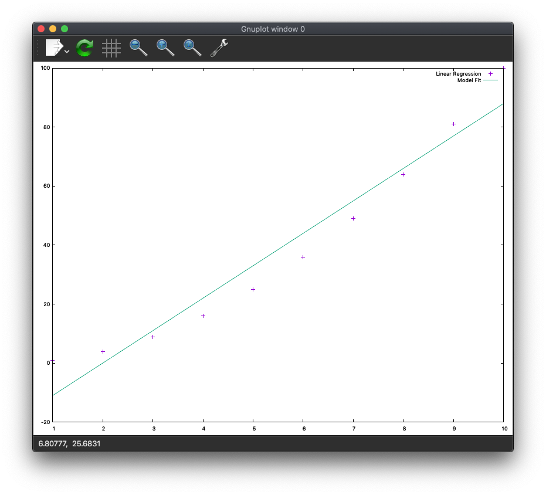

# How i setup my Mac for development

# Table of Contents
<details>
  <summary>Click to expand!</summary>

<!--ts-->
  * [Introduction](#introduction)
  * [Package Manager](#package-manager)
    * [Brew Installation](#brew-installation)
    * [Basic Packages](#basic-packages)
  * [Basic zshrc](#basic-zshrc)
  * [Browsers](#browsers)
  * [Editors and IDEs](#editors-and-ides)
  * [Languages and Compilers](#languages-and-compilers)
  * [Containers: Docker, Podman, Colima](#containers-docker-podman-colima)
  * [Python](#python)
  * [AWS](#aws)
    * [awscliv1](#awscliv1)
    * [awscliv2](#awscliv2)
  * [Drawing Tool (drawio)](#drawing-tool)
  * [Mathy Stuff](#mathy-stuff)
    * [LaTeXiT](#latexit)
      * [Riemann Zeta Function](#riemann-zeta-function)
      * [EFE](#efe)
      * [A more complex example](#a-more-complex-example)
    * [Geogebra](#geogebra)
      * [Cone](#cone)
      * [Saddle Plot](#saddle-plot)
      * [Linear Regression Plot](#simple-linear-regression-analysis)
    * [GNUplot](#gnuplot)
      * [Linear Regression Plot](#linear-regression-plot)
    * [Grafana](#grafana)
  * [Animated GIFs](#animated-gifs)
  * [Visual Diffs](#visual-diffs)
  * [Appendix A - Removing macports](#appendix-a---removing-macports)
  * [Appendix B - Embed Math Equations in Emacs](#appendix-b---embed-math-equations-in-emacs)
  * [Appendix C - Multiline jq Queries](#appendix-c---multiline-jq-queries)
  * [Appendix D - Search a Huge Number of Files](#appendix-d---search-a-huge-number-of-files)
  * [Appendix E - Spell Check Markdown Files](#appendix-e---spell-check-markdown-files)
  * [Appendix F - Useful CLI tools](#appendix-f---useful-cli-tools)
  * [Appendix G - make $HOME/icloud link](#appendix-g---make-homeicloud-link)
  * [Appendix H - Trace bash statements (extend -x via PS4)](#appendix-h---trace-bash-and-zsh-statements-extend--x-via-ps4)

<!--te-->
</details>

# Introduction
This document describes how i setup my mac for development work. It is
not official in any way and the choice of tools is opinionated. It is very
much a _note to self_. Hopefully it will be of some use to other folks.

The Mac is not my first choice for a development environment mainly
because it runs Mac OSX and my first choice is Linux but i
have both Linux and MacOS laptops and want to be able to use
both effectively.

I put this document together for two reasons.

First, _many_ of the native Mac OSX command line tools are ancient POSIX versions of things
like `bash`, `date`, `find`, `awk` and `xargs`.
In _most_ cases the tools have not been updated in _more_ than a decade when compared to their Linux counterparts
which means that they are often missing important bug fixes, performance enhancements and useful modern options.

Second, there are a number of tools that i use for analysis and i wanted to remember how to
install them on new mac laptops.

# Package Manager
I use `brew` for managing packages.
This is an opinionated choice based on my personal experience and
does not reflect on the suitability of other package managers
like `fink`, `macports` and `nix`. They are all excellent choices
depending on your specific requirements.
I feel that the choice of the command line tools _not the
package manager_ is what is important.

## Brew Installation
Basically i just followed the standard installation instructions from
the website: https://docs.brew.sh/Installation with a minor workaround for a
permissions issue.
```bash
xcode-select --install
/bin/bash -c "$(curl -fsSL https://raw.githubusercontent.com/Homebrew/install/HEAD/install.sh)"
sudo chown -R "$USER":admin /usr/local/*
brew update --force --quiet
```

You can search for packages here: https://formulae.brew.sh/formula/ or
by using `brew search...` on the command line.

Brew has one really annoying deficiency: you cannot search for
packages that contain a specific file as mentioned in
[this](https://stackoverflow.com/questions/70600918/is-there-a-way-to-search-for-packages-that-contain-a-specific-file-using-brew)
stack exchange issue.

## Basic Packages
Here is my list of installed packages. You can use this list
to install packages on your machine by copying the list below and running
the brew install command, something like this:

### brew-init.sh
This script will install them for you after you have installed `brew`.

<details>
  <summary>Click to expand!</summary>

```bash
#!/bin/zsh
# very simple script that installs the basic brew packages i use.
PKGS=(
    aspell
    aspell-dict-en
    bash
    bat
    cmake
    colordiff
    coreutils
    csvtk
    diffutils
    dust
    exa
    fd
    file
    findutils
    gawk
    git
    make
    gnuplot
    gnu-tar
    gnutls
    go
    grep
    gsed
    gtop
    hexyl
    htop
    imagemagick
    inetutils
    jq
    less
    openssh
    pandoc
    pipenv
    podman
    poppler
    ql
    procs
    python@3.8
    pythone@3.10
    ripgrep
    rsync
    sd
    shellcheck
    socat
    sshfs
    terraform
    tmux
    tokei
    tree
    ttyrec
    util-linux
    vim
    wget
    zenith
    zip
)
for PKG in "${PKGS[@]}"; do
    printf '\x1b[1mInstalling %s\x1b[0m\n' "$PKG"
    brew install "$PKG"
done

```
</details>

### List All Installed Packages
There are three examples in this section that show the commands i typically use to list the packaged
that have been installed. I tend to use the example 3 the most.

### Example 1. Simply list the package names

This is the simplest example. It just shows the intalled packages and their type: formula (brew) or cask.

```bash
column --version  # this will fail if the wrong version is in the path, see the note below for details
brew bundle dump --file - | egrep '^brew|^cask' | awk '{print $2,$1}' | sort -fu | column -dt | cat -n
```

> Note that getting this to work was a bit tricky because the `column` tool from the `util-linux` package
> was not installed in `/usr/local/bin` and the version shipped with MacOS tools was ancient and did not have
> the features needed.
> I fixed that by linking to the correct version and checking it by running `column --version`.
> Unfortunately, when the `util-linux` package is updated, the link has to be re-created manually.
```bash
column --version  # fails
ln -s /usr/local/Cellar/util-linux/$(brew list --versions -q util-linux | awk '{print $2}')/bin/column $HOME/bin/column
column --version  # works
```

This is what the output looks like:
<details>
  <summary>Click to expand!</summary>

```bash
     1	"aspell"         brew
     2	"bash"           brew
     3	"bat"            brew
     4	"cmake"          brew
     5	"colordiff"      brew
     6	"coreutils"      brew
     7	"csvtk"          brew
     8	"diffutils"      brew
     9	"docker"         cask
    10	"drawio"         cask
    11	"dust"           brew
    12	"emacs"          cask
    13	"emacs",         brew
    14	"exa"            brew
    15	"fd"             brew
    16	"file-formula"   brew
    17	"findutils"      brew
    18	"firefox"        cask
    19	"gawk"           brew
    20	"geogebra"       cask
    21	"git"            brew
    22	"glib"           brew
    23	"gnu-sed"        brew
    24	"gnu-tar"        brew
    25	"gnuplot"        brew
    26	"gnutls"         brew
    27	"go"             brew
    28	"google-chrome"  cask
    29	"grep"           brew
    30	"gtop"           brew
    31	"guile"          brew
    32	"harfbuzz"       brew
    33	"hexyl"          brew
    34	"htop"           brew
    35	"imagemagick"    brew
    36	"inetutils"      brew
    37	"jq"             brew
    38	"less"           brew
    39	"make"           brew
    40	"musescore"      cask
    41	"openssh"        brew
    42	"pandoc"         brew
    43	"pango"          brew
    44	"pipenv"         brew
    45	"podman"         brew
    46	"poppler"        brew
    47	"postgresql@14"  brew
    48	"procs"          brew
    49	"python@3.10"    brew
    50	"python@3.8"     brew
    51	"qemu"           brew
    52	"qt@5"           brew
    53	"ripgrep"        brew
    54	"rsync"          brew
    55	"ruby"           brew
    56	"sd"             brew
    57	"shellcheck"     brew
    58	"socat"          brew
    59	"sqlite"         brew
    60	"terraform"      brew
    61	"tmux"           brew
    62	"tokei"          brew
    63	"tree"           brew
    64	"ttyrec"         brew
    65	"util-linux"     brew
    66	"vim"            brew
    67	"wget"           brew
    68	"zenith"         brew
    69	"zip"            brew
```

</details>

### Example 2. List the packages with more details.

This example lists all formulae and casks along with their versions
along with other miscellaneous information.

```bash
column --version  # this will fail if the wrong version is in the path, see the note in example 1 for details
brew bundle dump --file - 2>/dev/null | awk -F'"' '{print $2}' | \
    xargs -I{} bash -c "grep '{}:' <(brew info -q {})" 2>/dev/null | \
    sort -fu | column -dt | cat -n
```

This is what the output looks like:
<details>
  <summary>Click to expand!</summary>

```bash
     1	==>  aspell:         stable           0.60.8          (bottled)               
     2	==>  bash:           stable           5.2.12          (bottled),  HEAD        
     3	==>  bat:            stable           0.22.1          (bottled),  HEAD        
     4	==>  cmake:          stable           3.25.0          (bottled),  HEAD        
     5	==>  colordiff:      stable           1.0.20          (bottled)               
     6	==>  coreutils:      stable           9.1             (bottled),  HEAD        
     7	==>  csvtk:          stable           0.25.0          (bottled)               
     8	==>  diffutils:      stable           3.8             (bottled)               
     9	==>  docker:         stable           20.10.21        (bottled),  HEAD        
    10	==>  drawio:         20.3.0           (auto_updates)                          
    11	==>  dust:           stable           0.8.3           (bottled),  HEAD        
    12	==>  emacs:          stable           28.2            (bottled),  HEAD        
    13	==>  exa:            stable           0.10.1          (bottled),  HEAD        
    14	==>  fd:             stable           8.5.3           (bottled),  HEAD        
    15	==>  file-formula:   stable           5.43            (bottled),  HEAD        [keg-only]
    16	==>  findutils:      stable           4.9.0           (bottled)               
    17	==>  firefox:        107.0            (auto_updates)                          
    18	==>  gawk:           stable           5.2.1           (bottled),  HEAD        
    19	==>  geogebra:       6.0.745.0                                                
    20	==>  git:            stable           2.38.1          (bottled),  HEAD        
    21	==>  glib:           stable           2.74.0          (bottled)               
    22	==>  gnu-sed:        stable           4.9             (bottled)               
    23	==>  gnu-tar:        stable           1.34            (bottled),  HEAD        
    24	==>  gnuplot:        stable           5.4.5           (bottled),  HEAD        
    25	==>  gnutls:         stable           3.7.8           (bottled)               
    26	==>  go:             stable           1.19.3          (bottled),  HEAD        
    27	==>  google-chrome:  107.0.5304.121   (auto_updates)                          
    28	==>  grep:           stable           3.8             (bottled)               
    29	==>  gtop:           stable           1.1.3           (bottled)               
    30	==>  guile:          stable           3.0.8           (bottled),  HEAD        
    31	==>  harfbuzz:       stable           5.3.1           (bottled),  HEAD        
    32	==>  hexyl:          stable           0.10.0          (bottled),  HEAD        
    33	==>  htop:           stable           3.2.1           (bottled),  HEAD        
    34	==>  imagemagick:    stable           7.1.0-52        (bottled),  HEAD        
    35	==>  inetutils:      stable           2.4             (bottled)               
    36	==>  jq:             stable           1.6             (bottled),  HEAD        
    37	==>  less:           stable           608             (bottled),  HEAD        
    38	==>  make:           stable           4.4             (bottled)               
    39	==>  musescore:      3.6.2.548020600                                          
    40	==>  openssh:        stable           9.1p1           (bottled)               
    41	==>  pandoc:         stable           2.19.2          (bottled),  HEAD        
    42	==>  pango:          stable           1.50.12         (bottled),  HEAD        
    43	==>  pipenv:         stable           2022.9.24       (bottled)               
    44	==>  podman:         stable           4.3.1           (bottled),  HEAD        
    45	==>  poppler:        stable           22.11.0         (bottled),  HEAD        
    46	==>  postgresql@14:  stable           14.6            (bottled)               
    47	==>  procs:          stable           0.13.3          (bottled)               
    48	==>  python@3.10:    stable           3.10.8          (bottled)               
    49	==>  python@3.8:     stable           3.8.15          (bottled)               
    50	==>  qemu:           stable           7.1.0           (bottled),  HEAD        
    51	==>  qt@5:           stable           5.15.7          (bottled)   [keg-only]  
    52	==>  ripgrep:        stable           13.0.0          (bottled),  HEAD        
    53	==>  rsync:          stable           3.2.7           (bottled)               
    54	==>  ruby:           stable           3.1.2           (bottled),  HEAD        [keg-only]
    55	==>  sd:             stable           0.7.6           (bottled)               
    56	==>  shellcheck:     stable           0.8.0           (bottled),  HEAD        
    57	==>  socat:          stable           1.7.4.4         (bottled)               
    58	==>  sqlite:         stable           3.40.0          (bottled)   [keg-only]  
    59	==>  terraform:      stable           1.3.5           (bottled),  HEAD        
    60	==>  tmux:           stable           3.3a            (bottled),  HEAD        
    61	==>  tokei:          stable           12.1.2          (bottled)               
    62	==>  tree:           stable           2.0.4           (bottled)               
    63	==>  ttyrec:         stable           1.0.8           (bottled)               
    64	==>  util-linux:     stable           2.38.1          (bottled)   [keg-only]  
    65	==>  vim:            stable           9.0.0950        (bottled),  HEAD        
    66	==>  wget:           stable           1.21.3          (bottled),  HEAD        
    67	==>  zenith:         stable           0.13.1          (bottled),  HEAD        
    68	==>  zip:            stable           3.0             (bottled)   [keg-only]
```

</details>

### Example 3. List the package names and versions.

This example shows how to list the packages (casks and formulae) and their versions.

> Note that this command changed for the most recent version of brew as of 2022-10-05
> because the output from `brew bundle dump` changed.

```bash
column --version  # this will fail if the wrong version is in the path, see the note in example 1 for details
brew bundle dump --file - 2>/dev/null | \
   awk -F'"' '{print $2}' | \
   xargs -I{} bash -c "grep '{}:' <(brew info -q {})" 2>/dev/null | \
   awk '{if (NF == 3) {print $2,$3} else {if ($3 == "stable") {print $2,$4} }}' |\
   tr -d ':' | sort -fu | column -dt | cat -n
```

This is what the output looks like:
<details>
  <summary>Click to expand!</summary>

```bash
        1	aspell         0.60.8
        2	bash           5.2.12
        3	bat            0.22.1
        4	cmake          3.25.0
        5	colordiff      1.0.20
        6	coreutils      9.1
        7	csvtk          0.25.0
        8	diffutils      3.8
        9	docker         20.10.21
       10	dust           0.8.3
       11	emacs          28.2
       12	exa            0.10.1
       13	fd             8.5.3
       14	file-formula   5.43
       15	findutils      4.9.0
       16	gawk           5.2.1
       17	geogebra       6.0.745.0
       18	git            2.38.1
       19	glib           2.74.0
       20	gnu-sed        4.9
       21	gnu-tar        1.34
       22	gnuplot        5.4.5
       23	gnutls         3.7.8
       24	go             1.19.3
       25	grep           3.8
       26	gtop           1.1.3
       27	guile          3.0.8
       28	harfbuzz       5.3.1
       29	hexyl          0.10.0
       30	htop           3.2.1
       31	imagemagick    7.1.0-52
       32	inetutils      2.4
       33	jq             1.6
       34	less           608
       35	make           4.4
       36	musescore      3.6.2.548020600
       37	openssh        9.1p1
       38	pandoc         2.19.2
       39	pango          1.50.12
       40	pipenv         2022.9.24
       41	podman         4.3.1
       42	poppler        22.11.0
       43	postgresql@14  14.6
       44	procs          0.13.3
       45	python@3.10    3.10.8
       46	python@3.8     3.8.15
       47	qemu           7.1.0
       48	qt@5           5.15.7
       49	ripgrep        13.0.0
       50	rsync          3.2.7
       51	ruby           3.1.2
       52	sd             0.7.6
       53	shellcheck     0.8.0
       54	socat          1.7.4.4
       55	sqlite         3.40.0
       56	terraform      1.3.5
       57	tmux           3.3a
       58	tokei          12.1.2
       59	tree           2.0.4
       60	ttyrec         1.0.8
       61	util-linux     2.38.1
       62	vim            9.0.0950
       63	wget           1.21.3
       64	zenith         0.13.1
       65	zip            3.0
```

</details>

### Setup Links to Reference Updated Common Tools

This configures the system use newer versions of
common tools like `awk`, `date` and `xargs` by default
in your environment.

You might ask why use _links_ instead of _aliases_? That is a good question.
Using _aliases_ is perfectly reasonable. I chose links so that new commands
would be present in different shells and, in some configurations, subshells.

Here is the script that sets up the links.

<details>
  <summary>Click to expand!</summary>

```bash
#!/usr/bin/env bash
#
# Set up links to newer versions of tools that i use a lot.
#
set -ex
rm -f $HOME/bin/awk
rm -f $HOME/bin/column
rm -f $HOME/bin/date
rm -f $HOME/bin/find
rm -f $HOME/bin/grep
rm -f $HOME/bin/make
rm -f $HOME/bin/readlink
rm -f $HOME/bin/sed
rm -f $HOME/bin/sort
rm -f $HOME/bin/tar
rm -f $HOME/bin/xargs

ln -s /usr/local/bin/gawk $HOME/bin/awk
ln -s /usr/local/Cellar/util-linux/$(brew list --versions -q util-linux | awk '{print $2}')/bin/column $HOME/bin/column
ln -s /usr/local/bin/gdate $HOME/bin/date
ln -s /usr/local/bin/gfind $HOME/bin/find
ln -s /usr/local/bin/ggrep $HOME/bin/grep
ln -s /usr/local/bin/gmake $HOME/bin/make
ln -s /usr/local/bin/readlink $HOME/bin/readlink
ln -s /usr/local/bin/gsed $HOME/bin/sed
ln -s /usr/local/bin/gsort $HOME/bin/sort
ln -s /usr/local/bin/gnutar $HOME/bin/tar
ln -s /usr/local/bin/gxargs $HOME/bin/xargs
```

</details>

### Update Installed Packages
These are the commands i use to update the packages periodically.

```bash
xcode-select --install
brew update
brew upgrade
brew cleanup
brew doctor
rm -f $HOME/bin/column
ln -s /usr/local/Cellar/util-linux/$(brew list --versions -q util-linux | awk '{print $2}')/bin/column $HOME/bin/column
```

The `xcode-select` command verifies that the xcode command line tools are installed.
It is needed on rare occasions when MacOS is updated.

The $HOME/bin/column link is always updated to guarantee that it is correct when the `util-linux`
package is updated.

# Basic zshrc
Here is a very basic ~/.zshrc file that can be used to setup the new environment.
```bash
# assumes that /usr/local/bin is already in $PATH
export PATH="${HOME}/bin:${PATH}"
```

Make sure to check the path settings
```bash
$ echo $path | tr ' ' '\n' | cat -n
     1	/Users/Joseph.Linoff/bin
     2	/usr/local/bin
     3	/usr/bin
     4	/bin
     5	/usr/sbin
     6	/sbin

```

# Browsers
You might want to use a browser other than Safari for testing and other things.

Here are some browsers that i have found useful.

| browser | installation |
| ------- | ------------ |
| brave | `brew install --cask brew` |
| firefox | `brew install --cask firefox` |
| ghost | `brew install --cask ghost-browser` |
| google-chrome | `brew install --cask google-chrome` |
| opera | `brew install --cask opera` |
| tor | `brew install --cask tor-browser` |

# Editors and IDEs

_Everyone_ uses emacs, right? (JOKE!!!)...

> I certainly do (for org-mode alone) but there are many other awesome options available and i am not opiniated about editors or IDE's.

Here are links for a number of popular editors and IDEs that i am aware of. If you have a favorite that is NOT listed please let me know and i will add it.

| editor | link | installation |
|--------|------| ------------ |
| atom    | https://atom.io/ | `brew install --cask atom` |
| Eclipse | https://www.eclipse.org/ide/ | `brew install --cask eclipse-ide`  |
| emacs   | https://emacsformacosx.com/ |  `brew install --cask emacs` |
| Intellij IDEA | https://www.jetbrains.com/idea/ | `brew install --cask intellij-idea-ce` |
| Jupyter | https://jupyter.org/ | `brew install jupyterlab` |
| Komodo  | https://www.activestate.com/products/komodo-ide/ | `brew install --cask komodo-ide` |
| nano | https://www.nano-editor.org/ | `brew install nano` |
| PyCharm | https://www.jetbrains.com/pycharm/ | `brew install --cask pycharm-ce` |
| sublime | https://www.sublimetext.com/ | `brew install --cask sublime-text` |
| vim | https://www.vim.org/ | `brew install vim` |
| visual studio | https://code.visualstudio.com/ | `brew install --cask visual-studio-code` |

> or you can simply use the native TextEdit editor.

# Languages and Compilers
I normally install all languages and compilers through brew. Here are some examples:
1. `brew install python`
2. `brew install erlang`
3. `brew install go`
4. `brew install rust`

# Containers: Docker, Podman, Colima
All of these are awesome [open container initiative](https://opencontainers.org/) (OCI) projects.

I use docker for many personal projects so the change to the user subscription model
that took effect on January 31, 2022 does not affect me. The UI interface is pretty nifty.

And even though [podman](https://podman.io/) bind mounts do not work on MacOS, I have used `podman` and shared
files by creating a volume that allows me to copy data in and out of containers. Once the volume mount
problem is fixed i will may switch to podman in the future for containers because i like the execution model
better. See this [link](https://github.com/containers/podman/issues/8016) for information about progress
towards fixing the `podman` volume mount problem.

I really like where [colima](https://github.com/abiosoft/colima) is going as well and am keeping an eye on it.

Neither podman or colima are a replacement for docker on mac yet because of their lack of support for volume mounts.

### Update on 2022-05-03
It looks like podman now supports volume mounts on MacOS!
Here is what you need to do to allow podman containers to access your home directory tree.
```bash
podman machine rm
podman machine init --cpus=2 --disk-size=60 --memory=4096 -v $HOME:$HOME --volume-driver=virtfs --now
podman machine list
podman run -it --rm -h test1 --name test1 -v $HOME:$HOME ubuntu bash -c "ls -l $HOME/"
```

> Many thanks to Brendon Walsh for reporting this.

# Python
I tend to use `pipenv` (`brew install pipenv`) for all of my python projects so that each project
has its own environment to avoid conflicts.

> brew doesn’t make all versions of all programs available directly
> from /usr/local/bin. Instead it stores them separately in
> /usr/local/opt/VERSION/bin. This behavior is different than macports
> which makes them all available and guarantees that they are
> interoperable.

## Python-3.10 Example
I chose this because at the time of this writing python3.10 is not the default. The default is python3.9.
```bash
# installs python-3.10 in the local pipenv environment
# requires brew install python@3.10
brew install python@3.10
pipenv install --python /usr/local/opt/python@3.10/bin/python3.10 mypy pylint
pipenv run python --version
```

# AWS
Normally awscliv2 is preferred but, as i understand it, both versions
will be supported for the foreseeable future.

## awscliv1

Here is how to install awscliv1

```bash
brew install awscli@1
pipenv install --python /usr/local/opt/python@3.10/bin/python3.10 mypy pylint awscli
pipenv run aws --version
```

## awscliv2
For some reason AWS decided NOT to use pypi for the version 2 which i
find unfathomable but that is what they did.

I have documented two ways to install it. I prefer the brew method
because it is the simplest and the version is the same as the AWS raw
package method.

### brew
```bash
brew install awscli
aws --version  # output: aws-cli/2.2.39 Python/3.9.6 Darwin/19.6.0 source/x86_64 prompt/off
```

### AWS raw package
I think that you have to do this periodically to keep it up to date.
```bash
curl "https://awscli.amazonaws.com/AWSCLIV2.pkg" -o "AWSCLIV2.pkg"
sudo installer -pkg ./AWSCLIV2.pkg -target /
aws --version  # aws-cli/2.2.39 Python/3.9.6 Darwin/19.6.0 source/x86_64 prompt/off
```

Reference: https://docs.aws.amazon.com/cli/latest/userguide/getting-started-install.html

# Drawing Tool

I use `draw.io.app` from https://drawio-app.com/ or all of my local drawing and diagramming needs.

You can download it here:  https://github.com/jgraph/drawio-desktop/releases/
or you can use it in your browser: https://app.diagrams.net/
or you can use brew: `brew install --cask drawio`.

I use a locally installed version.

I also added two Google fonts: "Nanum Brush Script" and "Nanum Pen Script", permanently by following these steps:

1. Create a new drawing.
2. Select `Extras` → `Configuration...` from the menu.
3. Add this configuration JSON and click the `Apply` button:
```json
{
  "fontCss": "@import url('https://fonts.googleapis.com/css?family=Nanum+Pen+Script&display=swap'); @import url('https://fonts.googleapis.com/css?family=Nanum+Brush+Script&display=swap');",
  "customFonts": [
    "Nanum Brush Script",
    "Nanum Pen Script"
  ]
}
```
4. These fonts will now be available when drawio starts.

This is what the draw.ip.app configuration looks like.


See [this](https://www.diagrams.net/doc/faq/custom-fonts-confluence-cloud) link for more information.

# Mathy Stuff

I use LaTeXiT for creating equations and gnuplot for basic plotting.

> Breaking news! I recently switched from gnuplot to [matplotlib](https://matplotlib.org/) and am very happy with it!
> It can be installed using _pip_ or _pipenv_.
> See [this](https://gist.github.com/jlinoff/f3fd81748b0bcb0a3b033b921e8ee85a) gist for a simple example.

I also use geogebra for simple modeling (only simple because i don't know it that well) as well as grafana with postrgresql for browser based plotting. Note, however, that i tend to use both grafana and postgres in containers as described
[here](https://gist.github.com/jlinoff/6e2127ee8b9522da9bc20b20be980818).

Here are the commands to install them.

| package  | install |
|----------|---------|
| geogebra | `brew install --cask geogebra` |
| grafana  | `brew install grafana` |
| gnuplot  | `brew install gnuplot` |
| latexit  | `brew install --cask latexit` |
| postgresql | `brew install postgresql@14` |

These are just my basic _go to_ tools for playing around. If you are doing serious work, you will have your own more specialized tools.

## LaTeXiT
I only use this for quickly testing small LaTeX equations. If you want to write full LaTeX documents,
better choices might be `emacs org-mode`, `texmaker` or `MacTex`.
Here are several examples that show where LaTeXit shines.

### Riemann Zeta Function
One of my all time favorites:
```latex
\zeta ( s ) = \sum_{n=1}^{\infty} \frac{1}{n^s}
```


### EFE
Blast from the past.
```latex
R_{\mu \nu} - {1 \over 2}R \, g_{\mu \nu} + \Lambda g_{\mu \nu}={8 \pi G \over c^4} T_{\mu \nu}
```


### A more complex example

Derived from a joke found [here](https://www.math.utah.edu/~cherk/mathjokes.html).

To make this work in LaTeXiT, you must use `text` mode.
```latex
\begin{center}
{\large Real World Math}
\end{center}
Postulate 1: Knowledge = Power \\
Postulate 2: Time = Money \\
Define Power:
\begin{flalign}
{Power = \frac {Work} {Time}}
\end{flalign}
Substitute Knowledge for Power:
\begin{flalign}
{Knowledge = \frac {Work} {Time}}
\end{flalign}
Define Time:
\begin{flalign}
{Time = \frac {Work} {Knowledge}}
\end{flalign}
Substitute Money for Time:
\begin{flalign}
{Money = \frac {Work} {Knowledge}}
\end{flalign}
In the limit:
\begin{flalign}
\therefore \lim_{Knowledge \to 0} {Money = \frac {Work} {Knowledge}}  \rightarrow \infty
\end{flalign}
As Knowledge goes to zero, money goes to infinity, regardless of the amount of work.
```


## Geogebra
Here is geogebra in action.

### Cone
 ` z^2 = x^2 + y^2`


### Saddle Plot
 `z=Surface(x,y,0.3 x^(2)-0.2 y^(2),x,-9,9,y,-10,10)`


### Simple linear regression analysis


 ## gnuplot
 IMHO, the best ever command line tool for plotting.

 ### Linear regression Plot


### gnuplot commands
```
f(x) = m*x + b
fit f(x) 'plot.data' using 1:2 via m,b
plot 'plot.data' using 1:2 title 'Linear Regression' with points, f(x) title 'Model Fit'
```

### gnuplot plot.data
```
#x y
1  1
2  4
3  9
4  16
5  25
6  36
7  49
8  64
9  81
10 100
```

## Grafana
I use Grafana along with Postgres for browser based analytics as described
[here](https://gist.github.com/jlinoff/6e2127ee8b9522da9bc20b20be980818).

# Animated GIFs

 I use imagmagick (`brew install imagmagick`) to create animated GiFs from PNG images created by screen capture or from `draw.io.app`.

 Here a simple example of the command line that assumes i created 3 images named `img1.png`, `img2.png`, `img3.png`.

 ```bash
 convert -delay 50 -loop 0 img1.png img2.png img3.png /tmp/aimg.gif
 ```

> Note that the hard part is creating the PNG files.

To get the size of the image.

```bash
convert 'aimg.gif[0]' -format 'dimensions: %wx%h\n' info:
```

To scale the image to 1/3 size.

```bash
H=$(echo "$(convert 'aimg.gif[0]' -format '%h' info:)" / 3 | bc)
W=$(echo "$(convert 'aimg.gif[0]' -format '%w' info:)" / 3 | bc)
convert aimg.gif -coalesce -scale "${W}x${H}" -layers Optimize aimg-small.gif
unset H
unset w
```

> This assumes that all frames are the size as the first one.

# Visual Diffs

I use `meld` for doing visual diffs.
It is sometimes quite convenient for git diffs to be able to see the diffs in a visual context.

You install it by running `brew install meld`.

For visual git diffs i use the command: `git difftool -y -t meld FILE`.

# Appendix A - Removing macports

If you are currently using macports and want to switch over to brew,
this script should completely remove macports from your system.

## delete-macports.sh
```bash
#!/bin/zsh
#
# Use zsh because that is now native to Macs.
#
# Completely remove macports.
#
port list requested > /tmp/pkgs.list
sudo port -fp uninstall --follow-dependents installed
sudo rm -rf /opt/local
sudo rm -rf /Applications/DarwinPorts
sudo rm -rf /Applications/MacPorts
sudo rm -rf /Library/LaunchDaemons/org.macports.*
sudo rm -rf /Library/Receipts/DarwinPorts*.pkg
sudo rm -rf /Library/Receipts/MacPorts*.pkg
sudo rm -rf /Library/StartupItems/DarwinPortsStartup
sudo rm -rf /Library/Tcl/darwinports1.0
sudo rm -rf /Library/Tcl/macports1.0
sudo rm -rf ~/.macports
```

# Appendix B - Embed Math Equations in Emacs

This documents how to ended math equations in emacs (in org-mode).
It is so specific that it is probably not of general interest.

> You must have tex installed (`brew install --cask mactex`)

## Source Code
```
*Math Equations in Emacs!* YAY!!

* Introduction
  We can the following equation in LaTeX by typing `~-c C-x C-l~.

* Equation
  Move the cursor over the equation and type ~C-c C-x C-l~ to toggle
  beack and forth between the math view and the text view.

  $$e^{\pi i}=-1$$

  That's pretty cool!

* Notes
  set ~org-format-latex-options~ value ~:scale 5.0~ to make the
  equation easier to read. The default is pretty squinty.
```

## Before


## After


# Appendix C - Multiline jq Queries
This is another note to self because use `jq` intermittently and don't always remember the details.
It shows how to use a shell variable to write multiline jq queries that includes left padding.
```bash
query=$(cat <<EOF
.|
select(.category.type=="class")|
select(.category.sub_type=="jq-101")|
[
.system.asset_id,
 .category.type,
 .category.sub_type,
 (
   (.category.created.year|tostring) +
   "-" +
   (.category.created.month|tostring|length| if . < 2 then "0" else "" end)+
   (.category.created.month|tostring) +
   "-" +
   (.category.created.day_of_month|tostring|length| if . < 2 then "0" else "" end) +
   (.category.created.day_of_month|tostring) +
   "T" +
   (.category.created.hour|tostring|length| if . < 2 then "0" else "" end) +
   (.category.created.hour|tostring) )
   ":" +
   (.category.created.minute|tostring|length| if . < 2 then "0" else "" end) +
   (.category.created.minute|tostring) )
   ":" +
   (.category.created.second|tostring|length| if . < 2 then "0" else "" end) +
   (.category.created.second|tostring) )
]
EOF
        )
    xargs -L1 jq -c $query classes.json
```

# Appendix D - Search a Huge Number of Files
Yet another note to self. This one shows how to use `find` and `xargs` when there are too
many files for `grep` or `rg`. I often combine this with `jq` to search for fields

```bash
# example 1: find all javascript source files that are missing copyright notices
find /thousands/of/js/files -type f -iname '*.js' | xargs -L1 -I{} grep -H -l -v -i  'copyright' {}

# example 2: count the number of different types from the JSON "type" field.
find /thousands/of/json/files -type f -iname '*.json' | xargs -L1 jq -c '.| [.type]' | \
    awk -F'"' '{print $1} | sort -f | uniq -c | sed -e 's/[\"\[\]]*//g' |awk '{printf("%6d %s\n",$1,$2)}'
```

# Appendix E - Spell Check Markdown Files
This is how i spell check markdown files.
```bash
# spell check README.md
aspell -c -d en --mode markdown README.md
```

# Appendix F - Useful CLI tools
This Medium article has a great list of useful CLI tools:
[17 Stunning & Modern UNIX Tools](https://link.medium.com/EkTY3ko7eob)  by thelicato.

# Appendix G - make $HOME/icloud link
Making a local, simple icloud reference without spaces in the path makes life easier.
```bash
ln -s $HOME/Library/Mobile\ Documents/com~apple~CloudDocs/ $HOME/icloud
```

Here is an example usage.
```bash
tree $HOME/icloud
```

# Appendix H - Trace bash and zsh statements (extend -x via PS4)
This example shows how to trace bash script execution by setting PS4 to print out each bash statement.
```bash
# What you need to add to your bash script.
PS4='$(printf "\033[1;34m+ %s %-20s\033[0m" $(date +"%Y-%m-%dT%H:%M:%S") "${LINENO}:${BASH_SOURCE[0]} => ")'
# turn on the verbose trace
set -x
# Example statements
date
echo $BASH_VERSION
# turn off the verbose trace
{ set +x; } 2>/dev/null
# Example statements that will not be traced
echo "NO TRACE"
```
